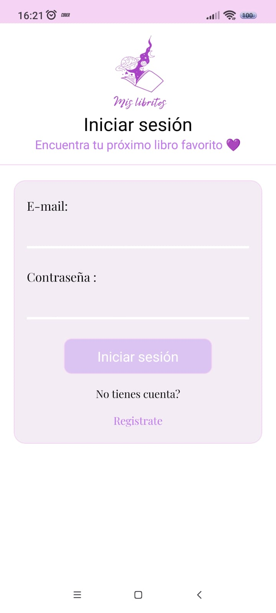

    

<h1 align="center"> Librería: Mis Libritos </h1>

<h4 align="center">
    :construction: Proyecto en construcción :construction:
</h4>

   

## :hammer: Funcionalidades del proyecto
`Funcionalidad`: Se trata de un e-commerce de venta de libros, realizado como entregas intermedias para el proyecto final para CoderHouse y realizado con React Native, Firebase y 💛.

## 🛠️ Abre y ejecuta el proyecto
<table>
    <tr>
        <td>Ejecución</td>
        <td>npm start</td>
    </tr>
</table>

<table>
    <tr>
        <th>Inicio de sesión</th>
        <th>Registro</th>
        <th>Categorías</th>
        <th>Libros</th>
        <th>Carrito</th>
        <th>Órdenes</th>
        <th>Detalle</th>
        <th>Perfil</th>
    </tr>
    <tr>
        <td></td>
        <td></td>
        <td></td>
        <td></td>
        <td></td>
        <td></td>
        <td></td>
        <td></td>
  </tr>
</table>

## 📦 Instalaciones: 
<table>
    <tr>
        <td>Instalación</td>
        <td>npm install</td>
    </tr>
    <tr>
        <td>Expo Fonts & Iconos</td>
        <td>
            <ul>
                <li>npm install expo/vector-icons</li>
                <li>npm install expo-font</li>
            </ul>
        </td>
    </tr>
    <tr>
        <td>Navegación</td>
        <td>
            <ul>
                <li>npm install @react-navigation/native</li>
                <li>npm install react-native-screens </li>
                <li>npm install react-native-safe-area-context</li>
                <li>npm install @react-navigation/native-stack</li>
            </ul>
        </td>
    </tr>
    <tr>
        <td>Redux</td>
        <td>npm install @reduxjs/toolkit react-redux</td>
    </tr>
    <tr>
        <td>YUP</td>
        <td>npm install yup</td>
    </tr>
    <tr>
        <td>Image Picker</td>
        <td>npm install expo-image-picker</td>
    </tr>
    <tr>
        <td>Expo Location</td>
        <td>npm install expo-location</td>
    </tr>
    <tr>
        <td>Dotenv (.env)</td>
        <td>
            <ul>
                <li>npm install dotenv</li>
                <li>npm install expo-constants</li>
            </ul>
        </td>
    </tr>
    <tr>
        <td>SQLite</td>
        <td>npm install expo-sqlite</td>
    </tr>
</table>

## 📃 Documentación útil
<table>
    <tr>
        <td>Jsons</td>
        <td>https://dummyjson.com/#google_vignette</td>
    </tr>
    <tr>
        <td>Colores</td>
        <td>https://color.adobe.com/es/create/color-wheel</td>
    </tr>
    <tr>
        <td>Iconos</td>
        <td>https://oblador.github.io/react-native-vector-icons/</td>
    </tr>
    <tr>
        <td>Navegación</td>
        <td>https://reactnavigation.org/docs/getting-started</td>
    </tr>
    <tr>
        <td>Expo</td>
        <td>https://docs.expo.dev/versions/latest/sdk/font/</td>
    </tr>
    <tr>
        <td>Redux Toolkit</td>
        <td>https://redux-toolkit.js.org/tutorials/quick-start/</td>
    </tr>
     <tr>
        <td>Redux Query</td>
        <td>https://redux-toolkit.js.org/rtk-query/overview</td>
    </tr>
    <tr>
        <td>Image picker</td>
        <td>https://docs.expo.dev/versions/latest/sdk/imagepicker/</td>
    </tr>
    <tr>
        <td>Google Maps</td>
        <td>
            <ul>
                <li>https://developers.google.com/maps/documentation/maps-static/overview?hl=es-419</li>
                <li>https://www.cloud.google.com</li>
                <li>https://developers.google.com/maps/documentation/geocoding/requests-reverse-geocoding?hl=es-419</li>
            </ul>
        </td>
    </tr>
    <tr>
        <td>Expo Location</td>
        <td>https://docs.expo.dev/versions/latest/sdk/location/</td>
    </tr>
    <tr>
        <td>Generador de fechas (Timestamp)</td>
        <td>https://www.unixtimestamp.com/</td>
    </tr>
    <tr>
        <td>Markdown language</td>
        <td>https://www.markdownguide.org/basic-syntax/</td>
    </tr> 
</table>

## 📱 Principios de optimización: 
- `KISS`: Keep it simple, stupid!
- `DRY`: Don't repeat yourself 
- `YAGNI`: You aren't gonna need it

## ⭐ Programadora estrella
Realizado por <a href="https://www.linkedin.com/in/cecilia-perdomo/">**Cecilia Perdomo**</a>, desde el 09 de Febrero 2024. 

##
